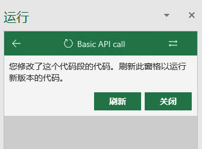

# Office Add-in的交互式设计

## 简介

Office Add-in是扩展Office功能的新一代技术。利用丰富的Office JavaScript API，开发者可以对Office文档进行各种操作。在新版本的Office中，我们发布了一套全新的事件相关的API。从此Add-in开发者可以检测到用户对Office文档的交互操作，从而对其进行针对性的响应。这个课程包括对Script Lab基本使用方式的介绍，及使用Excel Events API制作一个可响应用户交互的Add-in的示例。

### 动手实验的目标

这个实验将会向您展示

* 如何使用Script Lab创建一个测试用的Add-in
* 如何使用Excel Events API处理用户与Excel间的交互

### 系统需求

您需要安装

* Windows10
* Office365或Office2016/2019

### 配置

您需要执行以下步骤来为这次实验准备环境

1\. 安装Microsoft Windows 10.

2\. 安装Microsoft Office 365或者Microsoft Office 2016/2019

### 练习

本次动手实验包含以下几个部分

1\. 使用Script Lab创建一个测试用的Add-in

2\. 使用Excel Events API处理用户与Excel间的交互

## Exercise 1: 使用Script Lab创建一个测试用的Add-in

### Task 1 – 获取Script Lab

Script Lab是Microsoft Garage开发的一个Office Add-in。利用Script Lab，用户可以快速学习和测试Office JavaScript APIs，并可以快速进行产品原型开发以验证想法。

1\. 启动Excel。

2\. 新建空白工作簿。

3\. 点击 插入 -> 获取加载项，搜索 Script Lab，选择添加。
  

  
4\. 切换到Script Lab页。
  

  
5\. 此时您将看到如下图所示的页面。
  


### Task 2 – 使用Script Lab创建测试Add-in

1\. 依次点击Code和运行按钮。
  

  
2\. Excel右侧将会弹出两个窗格。 左侧的窗格是要运行的代码，右侧的窗格将会在之后运行左侧窗格的代码并呈现一个网页。
  

  
3\. 点击"Sample"标签中的"Basic API call"示例。Script Lab将自动在Code窗格加载一个简单示例。


4\. 运行窗格中将会自动出现"Basic API call"。单击它以运行示例。


5\. 选中B2单元格。


6\. 在右侧的运行窗格中，点击"Run Code"按钮。


7\. Code窗格中的代码将会运行。其将会把当前选中区域的背景色设为黄色，并在运行窗格的Console中输出当前选中区域的地址。


## Exercise 2: 使用Excel Events API处理用户与Excel间的交互

本练习将会展示如何在Office Add-in中嵌入外部服务，如何使用Office JavaScript API向文档中写入数据，以及如何基于用户在Excel中的交互操作自动更新Office Add-in的内容。

本练习基于Exercise 1。开始前，请确认Code窗格和运行窗格已经打开。"Basic API call"示例已经载入并可以运行。

### Task 1 – 在Office Add-in中载入Bing Maps

1\. 在Code窗格的"HTML"标签中，删除所有代码后，输入以下代码来准备调用Bing Maps API的环境。

```HTML
<script type='text/javascript' src='https://www.bing.com/api/maps/mapcontrol'></script>

<div id='myMap' style='width: 100vw; height: 90vh;'></div>
```

2\. 在Code窗格的"脚本"标签中，删除所有代码后，输入以下代码。以下代码调用了Bing Maps的API，加载了Bing Maps并在Office Add-in中显示。

```JavaScript
var map;

$(function () {
    initialize();
})

async function initialize() {
    await resetMap();
}

async function resetMap() {
    map = new Microsoft.Maps.Map(document.getElementById('myMap'), {
        credentials: ' AtKt9_0Jatx4AZxj5i8KIxiTwE1YqFKPuLsUCohH5vAs78lJljTIOPLKWpn5ZIOG',
        center: new Microsoft.Maps.Location(47.60357, -122.32945),
        zoom: 6
    });
}
```

请从下表中随机选择一个API Key替换上文中的credentials字段，以免超过API call的阈值。

|Bing Maps API key|
|---------------------------------------------------------------------|
| Ag8fZE-sTZQnyOiZRZj4OFcXFJ9b\_2pIlhk-QxU42H2WJLwnc\_ZS7z\_Z3S66UjMX |
| Ag6FUwrN6Ui0sTuYoIJvDzDE1IcMBYVW9w-guq6E8p4gjo6JaxaTwWiNYVoqy2U8 |
| AjkozWF3gpH3MOVuTlgVVdUNh5O1jHDwLMDvHNrcirUdywjD3500hwBuCAJLb201 |
| AtKt9\_0Jatx4AZxj5i8KIxiTwE1YqFKPuLsUCohH5vAs78lJljTIOPLKWpn5ZIOG |
| Atb-ksaA4TojV9DhXSvF5WKTogD1uJCfA7vhlobFe1XqsGmAf1P9r0j\_mh1y67VT |
| AlNICD-WXPGSr86GtlHeBJpQGjApv\_l6jIHCfiqhIqzLf9zeASqdGNAcaHs6WF8F |

3\. 运行窗格中将会出现如下所示的提示。点击刷新。



4\. 运行窗格将会显示如下图所示的界面。


### Task 2 – 在加载Add-in时插入初始化数据

1\. 在Code窗格的"脚本"标签中，加入以下代码。以下代码首先检测名为"Bing Maps"的工作表是否存在。如果不存在则新建该工作表。之后在该工作表上的A1:D8区域插入了示例数据，并对A1:D1区域的样式进行了处理。

```JavaScript
var sheetMap;

async function loadSampleData() {
    var values = [
        ['Country', 'Capital', 'Latitude', 'Longitude'],
        ['China', 'Beijing', '39.905897', '116.426269'],
        ['United Kingdom', 'London', '51.519159', '-0.125637'],
        ['France', 'Paris', '48.855224', '2.355298'],
        ['Russia', 'Moscow', '55.764156', '37.631101'],
        ['Japan', 'Tokyo', '35.729022', '139.728920'],
        ['Israel', 'Jerusalem', '31.768282', '35.212436'],
        ['Germany', 'Berlin', '52.520551', '13.405500']
    ];

    await Excel.run(async (ctx) => {
        sheetMap = ctx.workbook.worksheets.getItemOrNullObject('Bing Maps');

        await ctx.sync();
        if (sheetMap.isNullObject) {
            sheetMap = ctx.workbook.worksheets.add('Bing Maps');

            sheetMap.getRange("A1:D8").values = values;
            sheetMap.getRange("A1:D8").format.autofitColumns();
            sheetMap.getRange("A1:D1").format.fill.color = '0070B0';
            sheetMap.getRange("A1:D1").format.font.color = 'FFFFFF';
            sheetMap.getRange("A1:D1").format.font.bold = true;
        }
        sheetMap.activate();

        await ctx.sync();
    })
}
```

2\. 修改initialize()方法，加入下文中标注的代码来加载示例数据。

```JavaScript
async function initialize() {
    await resetMap();

    /* BEGIN: 需要加入的代码段 */
    await loadSampleData();
    /* END: 需要加入的代码段 */

}
```

3\. 刷新运行窗格。当代码运行完毕后，loadSampleData()方法将会在Excel中增加一个名为"Bing Maps"的Sheet，并在其中插入示例数据。


### Task 3 – 注册事件以在用户选中不同单元格时自动更新Bing Maps

1\. 在Code窗格的"HTML"标签中，在myMap上方加入以下代码来在UI上绘制两个按钮。

```Html
<div class='buttonGroup'>
    <button class="ms-Button ms-Button--compound" id="registerEvents">
        <span class="ms-Button-icon">
            <i class="ms-Icon ms-Icon--plus"></i>
        </span>
        <span class="ms-Button-label">Register</span>
    </button>
    <button class="ms-Button ms-Button--compound" id="unRegisterEvents">
        <span class="ms-Button-icon">
            <i class="ms-Icon ms-Icon--plus"></i>
        </span>
        <span class="ms-Button-label">UnRegister</span>
    </button>
</div>
```

2\. 在Code窗格的"样式"标签中，删除所有代码后，加入以下代码来调整两个按钮的位置。

```CSS
.buttonGroup {
    height: 90px;
}

.buttonGroup .ms-Button {
    float: left;
    margin: 10px;
}
```

3\. 修改initialize()方法，加入下文中标注的代码来注册两个按钮的单击事件。

```JavaScript
async function initialize() {
    await resetMap();
    await loadSampleData();

    /* BEGIN: 需要加入的代码段 */
    $("#registerEvents").click(() => tryCatch(registerEvents));
    $("#unRegisterEvents").click(() => tryCatch(unRegisterEvents));
    /* END: 需要加入的代码段 */
}
```

4\. 在Code窗格的"脚本"标签中，加入以下代码。下列代码包含注册事件，删除事件和事件响应函数的声明。并且包含了两个辅助函数displayMap()和tryCatch()。displayMap()会基于给定的参数调整Bing Maps。tryCatch()会捕获异常并在UI上弹出错误提示。这两个函数会在之后使用到。

```JavaScript
var dictHandlers = [];

async function registerEvents() {
}

async function unRegisterEvents() {
}

async function onBingMapsSelectionChanged(event) {
}

function displayMap(country, capital, latitude, longitude) {
    if (map == null) resetMap();
    map.setView({
        center: new Microsoft.Maps.Location(latitude, longitude),
    });
    var center = map.getCenter();
    var infobox = new Microsoft.Maps.Infobox(center, {
        title: capital,
        description: country
    });
    infobox.setMap(map);
}

/** Default helper for invoking an action and handling errors. */

asyncfunctiontryCatch(callback) {
    try {
        awaitcallback();
    }
    catch (error) {
        OfficeHelpers.UI.notify(error);
        OfficeHelpers.Utilities.log(error);
    }
}
```

5\. 实现registerEvents()方法。以下代码首先获取了名为"Bing Maps"的Sheet。然后对其调用了onSelectionChanged.add()方法，从而注册事件。注册事件后的返回值被存储到了dictHandlers中，以备之后删除事件时使用。这里我们使用了一个数组来存储注册事件后的返回值，这是因为用户可能多次点击"Register"按钮。

```JavaScript
async function registerEvents() {
    await Excel.run(async (context) => {
        var worksheetBingMaps = context.workbook.worksheets.getItem("Bing Maps");
        dictHandlers.push(worksheetBingMaps.onSelectionChanged.add(onBingMapsSelectionChanged));
        await context.sync();
        console.log("Event registered succcessfully on Bing Maps worksheet");
    });
}
```

6\. 实现unRegisterEvents方法。以下代码遍历了dictHandlers，并调用了其remove()方法来删除事件。

```JavaScript
async function unRegisterEvents() {
    for (var i = 0; i < dictHandlers.length; i++) {
        await Excel.run(dictHandlers[i].context, async function (context) {
            dictHandlers[i].remove();
        });
    }

    console.log("All " + dictHandlers.length + " events are unregistered.");
    dictHandlers = [];
}
```

7\. 实现onBingMapsSelectionChanged方法。以下代码首先从参数event中获取了Worksheet的ID和触发事件的address。基于这两个信息，我们可以知道是哪个range触发了SelectionChanged事件。基于此range，再进一步得到了country，capital，latitude和longitude信息，从而对Bing Maps进行更新。

```JavaScript
async function onBingMapsSelectionChanged(event) {
    console.log(JSON.stringify(event));
    await Excel.run(async (context) => {
        var worksheet = context.workbook.worksheets.getItem(event.worksheetId);
        var range = worksheet.getRange(event.address);
        range.load();
        await context.sync();

        if (range.columnIndex < 4) {
            range = range.getOffsetRange(0, 0 - range.columnIndex).getAbsoluteResizedRange(1, 4);
            range.load("values");
            await context.sync();

            var country = range.values[0][0];
            var capital = range.values[0][1];
            var latitude = range.values[0][2];
            var longitude = range.values[0][3];
            displayMap(country, capital, latitude, longitude);
        }
    })
}
```

8\. 刷新运行窗格。

9\. 点击"Register"按钮。在A2:D8区域中选中不同的单元格，运行窗格中的Bing Maps会自动聚焦到该地址。这是因为SelectionChanged事件被触发后，onBingMapsSelectionChanged()方法被调用了。


10\. 点击"UnRegister"按钮。在A2:D8区域中选中单元格时，Bing Maps不会自动更新。

### Task 4 – 注册事件以在用户切换到不同的Worksheet时自动显示或隐藏Bing Maps

1\. 在Code窗格的"脚本"标签中，加入以下代码。以下代码是Worksheet.Activated事件和Worksheet.Deactivated事件的处理函数。当用户切换到"Bing Maps" worksheet的时候，在运行窗格中将Bing Maps显示出来。当用户离开"Bing Maps" worksheet的时候，将运行窗格中的Bing Maps隐藏。

```JavaScript
async function onWorksheetActivated(event) {
    console.log(JSON.stringify(event));
    $("#myMap").show();
}

async function onWorksheetDeactivated(event) {
    console.log(JSON.stringify(event));
    $("#myMap").hide();
}
```

2\. 修改registerEvents()方法，加入下文中标注的代码来注册Worksheet.Activated和Worksheet.Deactivated事件。

```JavaScript
async function registerEvents() {
    await Excel.run(async (context) => {
        var worksheetBingMaps = context.workbook.worksheets.getItem("Bing Maps");
        dictHandlers.push(worksheetBingMaps.onSelectionChanged.add(onBingMapsSelectionChanged));

        /* BEGIN: 需要加入的代码段 */
        dictHandlers.push(worksheetBingMaps.onActivated.add(onWorksheetActivated));
        dictHandlers.push(worksheetBingMaps.onDeactivated.add(onWorksheetDeactivated));
        /* BEGIN: 需要加入的代码段 */

        await context.sync();
        console.log("Event registered succcessfully on Bing Maps worksheet");
    });
}
```

3\. 重新刷新运行窗格，并点击"Register"按钮。切换到其他Worksheet，如"Sheet1"上，此时会发现运行窗格中的BingMaps消失，并且Console中输出了Worksheet.Deactivated事件的信息。再切换回"Bing Maps" Worksheet，可以发现运行窗格中的BingMaps重新出现了，同样的，Console中也输出了Worksheet.Activated事件的信息。


至此，我们的实验就完成了。我们的参考代码可以从[GitHub](https://gist.github.com/73ee5fa0dd2f28ce08d15397f7c3a55d)上获取，并使用Script Lab的导入功能进行导入。

借助于Excel JavaScript APIs中的Events APIs，Add-in开发者可以感知用户与Excel的交互操作，从而在自己的Add-in中做出适当的响应。

除了实验中展示的三个事件外，我们还提供了更加丰富的事件供开发者使用。如果有兴趣对其进行进一步的了解，可以参考[这个链接](https://docs.microsoft.com/zh-cn/office/dev/add-ins/excel/excel-add-ins-events)。

